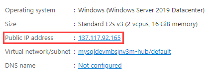

# Cloud Deployment to Azure VM

This is a simple app that runs PHP code to connect to a MYSQL database.

The app is running in an Azure VM and the App needs to be exposed to the internet via port 80 in order results to display.

## Test the Application #1

1. Open a browser to the Azure Portal
2. Navigate to the **paw-1** virtual machine
3. In the **Essentials** section, copy the public IP Address

   

4. Open a browser to the virtual machine ip address (ex `http:\\IP_ADDRESS:8080`)
5. A **ERR_CONNECTION_TIMED_OUT** error should occur.  This is because the network security group on the virtual machine does not allow port 8080 access.

## Open Port 8080

1. Navigate to the **Paw-1** machine, select it
2. Under **Settings**, select **Networking**
3. Select **Add inbound port rule**
4. For the destination port, type **8080**
5. For the name, type **Port_8080**
6. Select **Add**

   

## Test the Application #2

1. Retry connecting to the web application (ex `http:\\IP_ADDRESS:8080`), notice another timeout error
2. Switch back to the **paw-1** machine, run the following PowerShell command:

   ```PowerShell
   New-NetFirewallRule -DisplayName 'Port 8080' -Direction Inbound -Action Allow -Protocol TCP -LocalPort 8080
   ```

3. The application should load
4. Open a browser to the virtual machine ip address (ex `http:\\IP_ADDRESS:8080`)
5. The results should be displayed, but some files will not be download

## Edit .env file

1. Open the .env file
2. Edit the `APP_URL` to the `IP_ADDRESS` of the virtual machine.  Note that the url must change to `https` in order to properly load the application over SSL.
3. Save the file, refresh the browser window

## Enable Port 443

As part of any secured web application, SSL/TLS should be enabled.

1. Setup certificate on web machine
   - Open Internet Information Services (IIS) Manager
   - Select the server node
   - Select **Server certificates**

      

   - Select **Create self-signed certificate**
     - For the friendly name, type **paw-1**
     - For the certificate store, select **Web Hosting**
     - Select **OK**
<!--
   - For the friendly name, type **paw-1**
   - For the certificate store, select **Web Hosting**
   - For Common name, type **PHP Dev**
   - For Organization, type **PHP Dev**
   - For Organizational unit, type **Dev**
   - For City/locality, type **Redmond**
   - For State/province, type **WA**
   - Click **Next**
-->
1. Setup SSL
   - Expand the **Sites** node
   - Select the **ContosoStore** web site
   - In the actions, select **Bindings**
   - Select **Add**
   - For the type, select **https**
   - For the SSL certificate, select **paw-1**
   - Select **OK**

   

## Open Port 443

1. Navigate to the **Paw-1** machine, select it
2. Under **Settings**, select **Networking**
3. Select **Add inbound port rule**
4. For the destination port, type **443**
5. For the name, type **Port_443**
6. Select **Add**

## Test the Application #3

1. Retry connecting to the web application (ex `https:\\IP_ADDRESS:443`), an error should occur.
2. Switch back to the **paw-1** machine, run the following PowerShell:

   ```PowerShell
   New-NetFirewallRule -DisplayName 'Port 443' -Direction Inbound -Action Allow -Protocol TCP -LocalPort 443
   ```

3. Select the **Advanced** button
4. Select **Proceed to IP_ADDRESS (unsafe)**
5. The application should load
6. Open a browser to the virtual machine ip address (ex `https:\\IP_ADDRESS:443`)
7. The results should display
