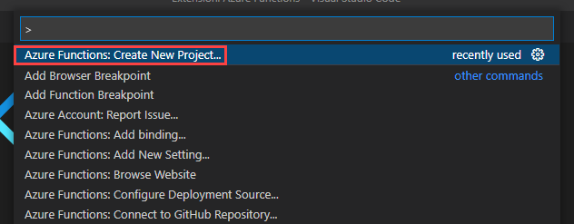
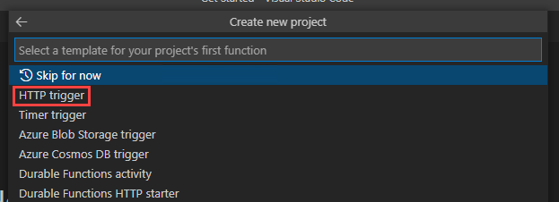
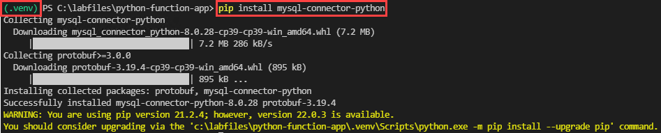
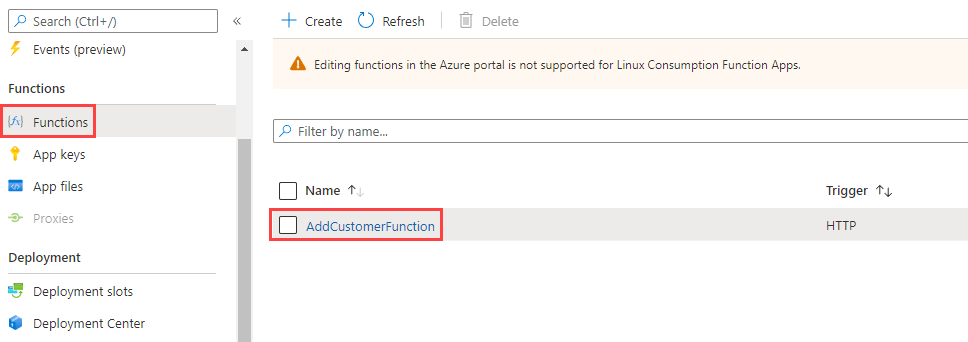
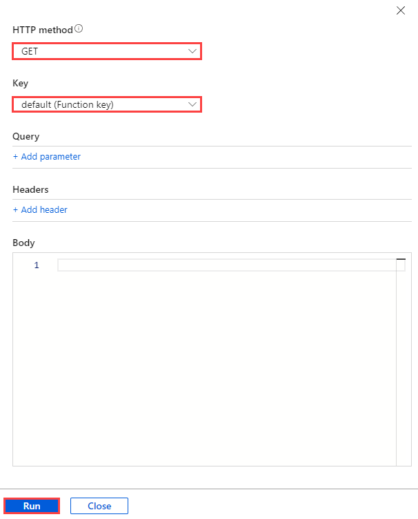
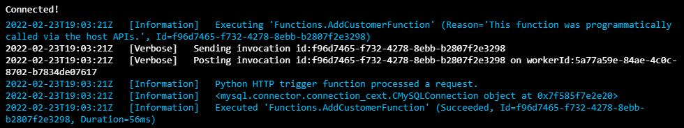

# Azure Function with MySQL (Python)

https://techcommunity.microsoft.com/t5/azure-database-for-mysql-blog/how-to-connect-to-azure-database-for-mysql-using-managed/ba-p/1518196

## Setup

It is possible to utilize several different tools including Visual Studio or Visual Studio Code to create Azure Functions.  

### Visual Studio Code

> **Note** that these steps have already been performed in the virtual machine environment.

- Install the [`Azure Functions`](https://marketplace.visualstudio.com/items?itemName=ms-azuretools.vscode-azurefunctions) and [`Python`](https://marketplace.visualstudio.com/items?itemName=ms-python.python) extensions
- Install [Python 3.9.x](https://www.python.org/downloads/)
- Install the [Azure Functions core tools MSI](https://go.microsoft.com/fwlink/?linkid=2174087)

## Create the Function Application

The application here is based on an HTTP Trigger that will then make a call into the Azure Database for MySQL instance and add some records. To create this function perform the following steps.

- Open Visual Studio Code, type **Ctrl-Shift-P**
- Select **Azure Functions: Create New Project**

    

- Select the project path (ex `c:\temp\python-function`)
- For the language, select **Python**
- Select the **python 3.9.x** option
- Select the **HTTP trigger**

    

- For the name, type **AddCustomerFunction**, press **ENTER**
- For the authorization level, select **Function**
- Select **Open in current window**
- Update the function code in `__init__.py` to the following, ensuring that the connection information is replaced. This Function completes the following tasks when its HTTP endpoint receives a request:
  - Connecting to the MySQL Flexible Server instance provisioned in the ARM template
  - Generating a list of databases on the MySQL instance
  - Building a formatted response
  - Returning the formatted response to the caller

```python
import logging
import azure.functions as func
import mysql.connector

def main(req: func.HttpRequest) -> func.HttpResponse:
    logging.info('Python HTTP trigger function processed a request.')
    # Connect to MySQL
    cnx = mysql.connector.connect(
        user="wsuser", 
        password='Solliance123', 
        host="mysqldevSUFFIXflex.mysql.database.azure.com", 
        port=3306
    )
    logging.info(cnx)
    # Show databases
    cursor = cnx.cursor()
    cursor.execute("SHOW DATABASES")
    result_list = cursor.fetchall()
    # Build result response text
    result_str_list = []
    for row in result_list:
        row_str = ', '.join([str(v) for v in row])
        result_str_list.append(row_str)
    result_str = '\n'.join(result_str_list)
    return func.HttpResponse(
        result_str,
        status_code=200
    )
```

- Open a terminal window (Select **Terminal->New Terminal window**)
  - Verify that the virtual environment created by the Azure Functions extension (the command prompt will be prefaced by `(.venv)`) is being used.
    - If the virtual environment is not active, open the command palette, select `Python: Select Interpreter`, and choose the virtual environment
  - Install the MySQL connector:

    ```powershell
    pip install mysql-connector-python
    ```

    

  - Run the function app:

    ```powershell
    func start run
    ```

- Open a browser window to the following. A list of databases should load:

    ```text
    http://localhost:7071/api/AddCustomerFunction
    ```

- An error should occur. Browse to the Azure Portal and the mysqldevSUFFIXflex flexible server
- Under **Settings**, select **Networking**
- Select **Add current IP address (x.x.x.x)**
- Select **Save**
- Retry the above url, the data will be displayed, however it is over non-SSL connection. Azure recommends that Flexible Server clients use the service's public SSL certificate for secure access. Download the [Azure SSL certificate](https://www.digicert.com/CACerts/BaltimoreCyberTrustRoot.crt.pem) to the Function App project root directory
- Add the following lines to the Python code to utilize the Flexible Server public certificate and support connections over TLS 1.2:

```python
crtpath = '../BaltimoreCyberTrustRoot.crt.pem'
#crtpath = '../DigiCertGlobalRootCA.crt.pem' #THIS IS THE OLD CERT, USE THE BALTIMORE CERT

# Connect to MySQL
cnx = mysql.connector.connect(
    user="wsuser", 
    password='Solliance123', 
    host="mysqldevSUFFIXflex.mysql.database.azure.com", 
    port=3306,
    ssl_ca=crtpath,
    tls_versions=['TLSv1.2']
)
```

- Call the endpoint again in a browser. The Function App should still operate

## Deploy the Function Application

Now that the Function App is created and working locally, the next step is to publish the Function App to Azure.  This will require some small changes.

- Add the following to the Python code:

```Python
import pathlib

def get_ssl_cert():
    current_path = pathlib.Path(__file__).parent.parent
    return str(current_path / 'BaltimoreCyberTrustRoot.crt.pem')
```

- Modify the `ssl_ca` parameter to call the `get_ssl_cert()` function and get the certificate file path

```python
ssl_ca=get_ssl_cert(),
```

- Open the `requirements.txt` file and modify to the following. The Azure Functions runtime will install the dependencies in this file

```text
azure-functions
mysql-connector-python
```

- Switch to the terminal window and run the following. Follow the instructions to log in to the Azure subscription:

```PowerShell
az login
```

- If necessary, switch to the target subscription:

```PowerShell
az account set --subscription 'SUBSCRIPTION NAME'
```

- Switch to the terminal window and run the following from the repository root:

```PowerShell
func azure functionapp publish mysqldevSUFFIX-addcustomerfunction
```

Browse to the function endpoint and see the data (the output of the previous command will include this information):

```text
https://mysqldevSUFFIX-addcustomerfunction.azurewebsites.net/api/addcustomerfunction?code=SOMECODE
```

## Test the Function App in the Azure portal

- Navigate to the Azure portal and select **AddCustomerFunction** from the **mysqldev[SUFFIX]-addcustomerfunction** Function App instance

    

- On the **AddCustomerFunction** page, **Code + Test**. Then, select **Test/Run** to access the built-in testing interface
- Issue a simple GET request to the Function App endpoint.

> **NOTE** It is possible to use a *function key*, which is scoped to an individual Function App, or a *host key*, which is scoped to an Azure Functions instance.

    

- The Function App should execute successfully, with logs indicating a successful connection to MySQL Flexible Server

    

## Troubleshooting

- If the Function App works locally, but fails in the cloud, ensure that the Azure environment is configured properly:
  - The `requirements.txt` file must reference the MySQL Python connector
  - The Flexible Server instance must provide access to all Azure resources
  - The Azure Function Apps instance must be using extension version `4`, as that is the what the local core tools support
