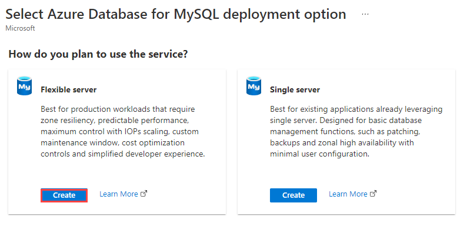
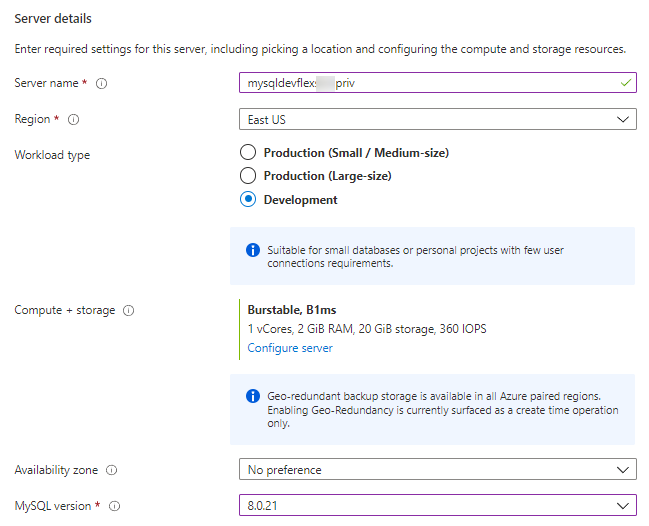
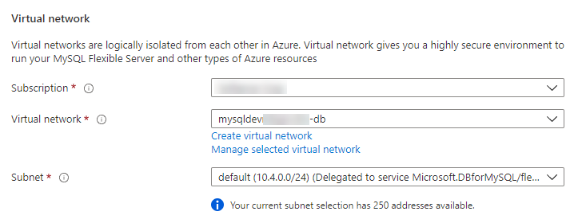
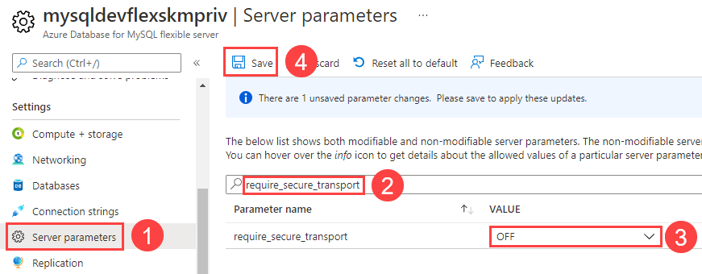
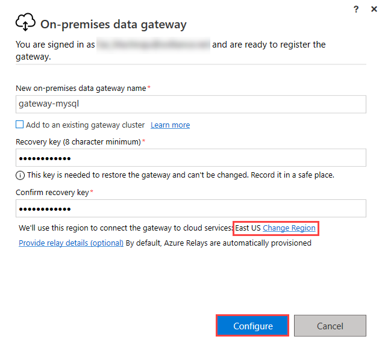
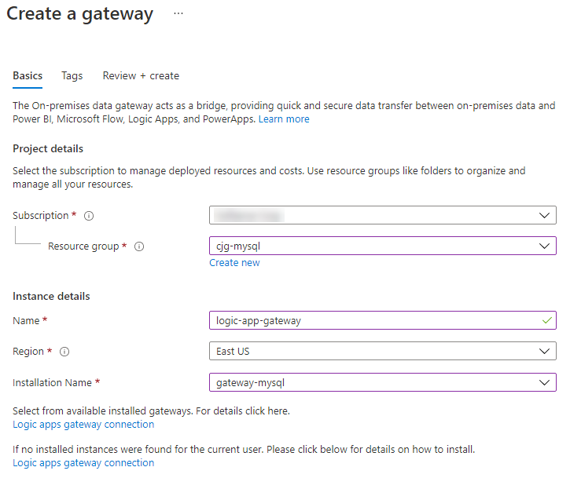
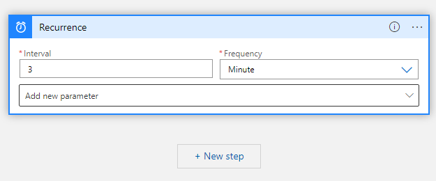

# Logic Apps with MySQL

Logic Apps can be used to connect to Azure Database for MySQL Flexible Server instances and perform actions such as SELECT, INSERT, DELETE and UPDATE.  However, Logic Apps do not have any direct integrations that allow for triggers that fire from MySQL DDL or DML events.  In order for the MySQL actions to connect to the MySQL instance, it is necessary to install a Logic Apps Gateway.  This can be done with Azure instances, but the Azure Database for MySQL will need private endpoints enabled and the gateway will need to run in a virtual machine that can access that private endpoint.

## Create a Private Endpoint Flexible Server

- Open the Azure Portal
- Browse to the lab resource group
- Find the **mysqldevSUFFIX-db** virtual network, take note of its region location
- In the top navigation menu, select **+Create**
- Search for **Azure Database for MySQL**
- Select **Create**
- Under **Flexible Server**, select **Create**

  

- Select the target subscription and resource group
- For the name, type **mysqldevSUFFIXflexpriv**
- Select the resource group region (it must be in the region that the VNet is in)
- For **Workload type**, select **Development** to save costs
- For **Availability zone**, select **No preference**
  - Co-locating the VM and the Flexible Server instance will improve network performance, but it is not strictly necessary
- For the **MySQL Version**, select **8.0.x**

  

- Do not enable high availability
- For the admin username, type **wsuser**
- For the password, type **Solliance123**
- Select **Next: Networking >**
- Select **Private access (VNet Integration)**
- Select the lab subscription
- Select the **mysqldev[SUFFIX]-db** vnet
- Select the **default** subnet, which is delegated to hold just Flexible Server instances

  

- Select the **private.mysql.database.azure.com** private DNS zone
- Select **Review + create**
- Select **Create**
- Navigate to the new Azure Database for MySQL Flexible Server instance
- Under **Settings** select **Server parameters**
- Search for the `require_secure_transport` setting
- Change the value to **OFF**
- Select **Save**

  

> **NOTE** The Log App Gateway can currently only do non-SSL connections to MySQL

> **NOTE** It is also possible to use the Azure CLI [`az mysql flexible-server create`](https://docs.microsoft.com/cli/azure/mysql/flexible-server?view=azure-cli-latest#az-mysql-flexible-server-create) command to provision a Flexible Server instance in a virtual network.

## Private DNS - Virtual network link

Several private DNS Zones were created as part of the ARM template deployment, here it will be necessary to link those to the virtual networks so DNS resolution of private vnet and private endpoint resources become resolvable by other resources (such as virtual machines).

- Browse to the **private.mysql.database.azure.com** private dns zone
- Under **Settings**, select **Virtual network links**, notice an auto-created link (from the resource creation above)
- Select the **Overview** link
- Record the database IP Address for later use
- It can take some time for the DNS to become available, on the **paw-1** virtual machine
- Open the `C:\Windows\System32\drivers\etc\HOSTS` file in notepad++
- Add the following to the file:

```text
10.4.0.6 mysqldevSUFFIXflexpriv.private.mysql.database.azure.com
```

## Configure the new Flexible Server instance

- Switch to the **paw-1** virtual machine
- Open a command prompt window and enter the following command to initiate a connection to the Flexible Server instance. Provide `Solliance123` as the password, when prompted. Be sure to replace the `SUFFIX`:

  ```cmd
  "C:\Program Files\MySQL\MySQL Workbench 8.0 CE\mysql.exe" -h mysqldevSUFFIXflexpriv.private.mysql.database.azure.com -u wsuser -p
  ```

- Create a new database, titled `noshnowapp`. Then, create a new table for orders. It is a simplified version of the table used by the Contoso NoshNow application.

  ```sql
  CREATE DATABASE noshnowapp;
  USE noshnowapp;

  CREATE TABLE orders (
    id int NOT NULL AUTO_INCREMENT PRIMARY KEY,
    name varchar(20) NOT NULL,
    address varchar(80) NOT NULL
  );
  ```

## Install the MySQL .NET Connector

- Log in to the **mysqldevSUFFIX-paw-1** virtual machine using **wsuser** and **Solliance123**
- [Download](https://go.microsoft.com/fwlink/?LinkId=278885) the connector
- Run the **mysql-installer...** installer
- Click through all the default values of all dialogs
- Select **Next**
- Select **Finish**

## Install the Logic Apps Gateway

- [Download](https://www.microsoft.com/en-us/download/details.aspx?id=53127) the Logic Apps Gateway
- Install the Logic Apps Gateway by running the **gatewayinstall.exe**
- Select **I accept the terms...** checkbox
- Select **Install**
- Enter the lab user email, then select **Sign in**
- When prompted, log in to the lab Azure account
- Select **Register a new gateway on this computer**
- Select **Next**
- For the name, type **gateway-mysql-SUFFIX**
- For the recovery key, type **Solliance123**
- Ensure that the region is the same as where the virtual network for the database instance is located
- Select **Configure**

  

## Configure the Logic Apps Gateway

- In the **On-premises data gateway** dialog, select **Create a gateway in Azure**
- Select the subscription and the resource group
- For the name, type **logic-app-gateway**
- Select the region used above
- Select the **gateway-mysql-SUFFIX** gateway
- Select **Review + create**
- Select **Create**

  

## Configure the Logic App

We have already created a Logic App that uses a timer trigger to check for new Orders in the database and then send an email.

### Configure deployed Logic App

- Browse to the **mysqldevSUFFIX-logic-app**
- Under **Development Tools**, select **API connections**
- Select **office365**
- Under **General**, select **Edit API Connection**
- Under the **Display Name** to your lab user email address
- Select **Authorize**, login using the lab credentials
- Select **Save**
- Select the **azureblob** connection
- Under **General**, select **Edit API Connection**
- Enter the **mysqldevSUFFIX**, azure storage account name and access key
- Select the **mysql** connection
- Under **General**, select **Edit API Connection**
- Enter the following information:
  - Server : `mysqldevSUFFIXflexpriv.private.mysql.database.azure.com`
  - Database name : `contosostore`
  - Username : `wsuser`
  - Password : `Solliance123`
  - Gateway : `gateway-mysql-SUFFIX`
- Select **Save**

### Create a Logic App (Optional)

This step has already been done for you, but if you'd like to create the logic app from scratch the steps are provided here.

- Select **Blank template**
- For the trigger, select **Recurrence**. Keep the default values

  

- Select **+ New step**, search for **MySQL**
- Select **Get Rows**
- Update the step variables:
  - For the name, type **mysqlflex**
  - For the server, type **mysqldevSUFFIXflexpriv.mysql.database.azure.com**.  

  > **Note** It may be necessary to put the private IP address if DNS resolution does not kick in in a reasonable amount of time.

  - For the database, type **noshnowapp**
  - For username, type **wsuser**
  - For password, type **Solliance123**
  - For the gateway, select **gateway-mysql-SUFFIX**
- Select **Create**
- For the table name, enter **noshnowapp.orders**
- Add the **Filter Query** and the **Select Query** parameters
- Set the following:
  - Filter Query = `name eq 'John'`
  - Leave Select Query blank
- Search for the **Office 365 Outlook : Send an email** action
- Select **Sign in**
- Sign in with the lab user credentials
- For the `To`, type the lab user email
- For the subject, enter **New Order Recieved**
- For the body, select **Add dynamic content**, then select **Current item**
- For the logic app, select **Save**

## Configure supporting items

### Add private endpoint to App Service

- Browse to the **mysqldevSUFFIX-web** app service
- Under **App Service plan**, select **App Service plan**
- Under **Settings**, select **Scale up (App Service plan)**
- Select **Production** tab
- Select the **P1V2** pricing tier
- Select **Apply**
- Switch back to the app service
- Under **Settings**, select **Networking**
- In the **Inbound Traffic** section, select **Private endpoints**
- Select **Add**
- For the name, type **mysqldevSUFFIX-web-pe**
- For the virtual network, select **mysqldevSUFFIX-web**
- Select the **default** subnet
- Select **OK**
- Browse to the **mysqldevSUFFIX-web** virtual network, record the new IP Address of the private endpoint.

### Set the Database Host

- Switch back to the main blade for the app service
- Under **Settings**, select **Configuration**
- Edit the app setting value for **DB_HOST** to the ip address recorded above.
- Select **Save**

### Add virtual network peering

- Browse to the **mysqldevSUFFIX-web** virtual network
- Under **Settings**, select **Peerings**
- Select **+Add**
- For the name, type **web-to-db**
- For the peering link name, type **db-to-web**
- For the virtual network, select **mysqldevSUFFIX-db**
- Select **Add**, after a couple minutes the link should to **Connected**
- Under **Settings**, select **Subnets**, ensure that a virtual network called **vnet-web-int**, if not create it
  - Select **+Subnet**
  - For the name, type **vnet-web-int**
  - Select **Save**

### Add VNet Integrate

- Browse back to the app service
- Under **Settings**, select **Networking**
- Under **Outbound Traffic**, select **VNet integration**
- Select **Add VNet**
- Select the **mysqldevSUFFIX-web** virtual network
- Select the **vnet-web-int** subnet
- Select **OK**

### Add the lastOrder.txt file

- Browse to the **mysqldevSUFFIX** storage account
- Select **Containers**, then select **logicapp**
- Upload the **lastOrder.txt** file

## Test Trigger

- On the **paw-1** virtual machine
- Add the following to the hosts file:

```text
10.3.0.4 mysqldev-app-web.azurewebsites.net
10.3.0.4 mysqldev-app-web.scm.azurewebsites.net
```

- Open a new Chrome browser window
- Browse to the Contoso Store app service - https://mysqldev-app-web.azurewebsites.net/
- Create a new order
- Browse to Outlook Online (https://outlook.office.com), wait for 5 minutes for an email to show up with the order details.
