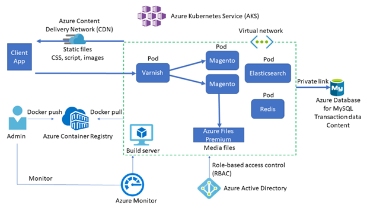

# Deploy Magento e-commerce on Azure

This repo contains an Azure Resource Manager (ARM) template designed for developers and architects who are planning to deploy Magento on Azure. For more details about the architecture, see the [Magento e-commerce in Azure Kubernetes Service (AKS)](https://docs.microsoft.com/azure/architecture/example-scenario/magento/magento-azure) guidance on the Azure Architecture Center.

## Solution architecture

The solution architecture for Magento running on Azure is shown in the following diagram.



The Azure services involved in this solution architecture are described below.

* [AKS](https://azure.microsoft.com/services/kubernetes-service/) deploys the Kubernetes cluster of Varnish, Magento, Redis, and [Elasticsearch](https://www.elastic.co/elasticsearch/) in different pods.
* AKS creates a [virtual network](https://azure.microsoft.com/services/virtual-network/) to deploy the agent nodes. Create the virtual network in advance to set up subnet configuration, private link, and egress restriction.
* [Varnish](https://varnish-cache.org/intro/index.html#intro) installs in front of the HTTP servers to act as a full-page cache.
* [Azure Database for MySQL](https://azure.microsoft.com/services/mysql/) stores transaction data such as orders and catalogs. Using version 8.0 is recommended.
* [Azure Files Premium](https://azure.microsoft.com/services/storage/files/) or an equivalent network-attached storage (NAS) system stores media files such as product images. Magento needs a Kubernetes-compatible file system such as Azure Files Premium or [Azure NetApp Files](https://azure.microsoft.com/services/netapp/), which can mount a volume in *ReadWriteMany* mode.
* A [content delivery network (CDN)](https://azure.microsoft.com/services/cdn/) serves static content such as CSS, JavaScript, and images. Serving content through a CDN minimizes network latency between users and the datacenter. A CDN can remove significant load from NAS by caching and serving static content.
* [Redis](https://redis.io/) stores session data. Hosting Redis on containers is recommended for performance reasons.
* AKS uses an Azure [Active Directory (Azure AD)](https://azure.microsoft.com/services/active-directory/) identity to create and manage other Azure resources like Azure load balancers, user authentication, role-based access control, and managed identity.
* [Azure Container Registry](https://azure.microsoft.com/services/container-registry/) stores the private [Docker](https://www.docker.com/) images that are deployed to the AKS cluster. You can use other container registries like Docker Hub. Note that the default Magento install writes some secrets to the image.
* [Azure Monitor](https://azure.microsoft.com/services/monitor/) collects and stores metrics and logs, including Azure service platform metrics and application telemetry. Azure Monitor integrates with AKS to collect controller, node, and container metrics, and container and master node logs.

## How to deploy the ARM template

To deploy this ARM template, open the Azure CLI, and then run the following command:

```azurecli-interactive
az deployment group create --resource-group <ResourceGroupName> --template-file azuredeploy.json
```

See [this article](https://docs.microsoft.com/en-us/azure/azure-resource-manager/templates/common-deployment-errors) for troubleshooting the deployment errors.

Alternatively, the following botton will allow you to deploy the APM template from Azure portal.
[](https://portal.azure.com/#create/Microsoft.Template/uri/https%3A%2F%2Fraw.githubusercontent.com%2Fdragon119%2Fazure-mysql%2Fmaster%2FMagento%2Fazuredeploy.json)

## Parameters

The following table shows a list of parameters to determine how much the cluster can scale. The default values are intentionally scaled down to avoid unnecessary costs for PoC. Values in the rightmost column are the ones we used in our performance test, when we achieved 340 orders per minute using the [Magento performance toolkit](https://github.com/magento/magento2/tree/2.4/setup/performance-toolkit).

| **Parameter** | **Default value** | **Value in our performance test** |
|---|---|---|
| `aksNodePoolSize` | 3 | 10 |
| `aksNodePoolVMSize` | Standard_DS2_v2 | Standard_F8s_v2 |
| `mySQLSkuName` | MO_Gen5_4 | MO_Gen5_16 |
| `mySQLSkuTier` | MemoryOptimized | MemoryOptimized |
| `mySQLSkuFamily` | Gen5 | Gen5 |
| `mySQLSkuCapacity` | 4 | 16 |
| `mySQLStorageSize` | 128000 | 512000 |
| `fileShareQuota` | 512 | 16384 |

## Next steps

For more details about the architecture, see the [Magento e-commerce in Azure Kubernetes Service (AKS)](https://docs.microsoft.com/azure/architecture/example-scenario/magento/magento-azure) guidance on the Azure Architecture Center.

## Cleanup resources

To remove this deployment simply remove the resource group that contains this sample.

## Code of Conduct

This project has adopted the [Microsoft Open Source Code of Conduct](https://opensource.microsoft.com/codeofconduct/). For more information, see the [Code of Conduct FAQ](https://opensource.microsoft.com/codeofconduct/faq/) or contact [opencode@microsoft.com](mailto:opencode@microsoft.com) with any additional questions or comments.

## Legal Notices

Microsoft and any contributors grant you a license to the Microsoft documentation and other content in this repository under the [Creative Commons Attribution 4.0 International Public License](https://creativecommons.org/licenses/by/4.0/legalcode), see the [LICENSE](https://github.com/Azure/Moodle/blob/master/LICENSE) file, and grant you a license to any code in the repository under the [MIT License](https://opensource.org/licenses/MIT), see the [LICENSE-CODE](https://github.com/Azure/Moodle/blob/master/LICENSE-CODE) file.

Microsoft, Windows, Microsoft Azure and/or other Microsoft products and services referenced in the documentation may be either trademarks or registered trademarks of Microsoft in the United States and/or other countries. The licenses for this project do not grant you rights to use any Microsoft names, logos, or trademarks. Microsoft's general trademark guidelines can be found at [Microsoft Trademarks](http://go.microsoft.com/fwlink/?LinkID=254653).

Privacy information can be found at [Privacy at Microsoft](https://privacy.microsoft.com/).
Microsoft and any contributors reserve all others rights, whether under their respective copyrights, patents, or trademarks, whether by implication, estoppel or otherwise.
