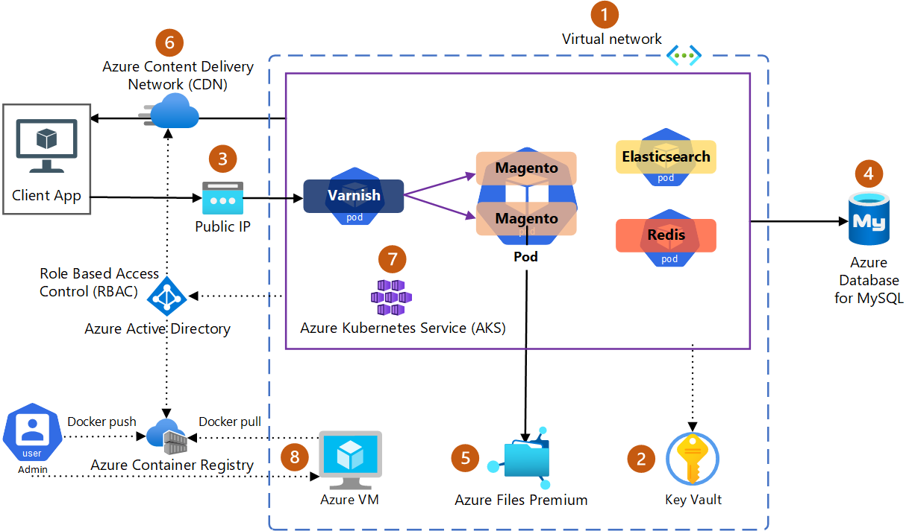

# One-click ARM template to deploy Magento OSS e-commerce app on Azure

## Introduction
[Magento Open Source](https://business.adobe.com/products/magento/open-source.html) is a free and flexible e-commerce platform that allows you to create and manage online stores. This Azure Resource Manager JSON template provides a easy one-click method to deploy Magento on Azure using following Azure services to provide an optimal experience of hosting Magento on Azure with tight integrations.

* [Azure Resource Manager (ARM) templates](https://learn.microsoft.com/en-in/azure/azure-resource-manager/templates/overview) 
* [Azure Kubernetes Service (AKS) documentation](https://learn.microsoft.com/en-us/azure/aks/)
* [Azure Container Registry documentation](https://learn.microsoft.com/en-us/azure/container-registry/)
* [Microsoft Entra ID](https://learn.microsoft.com/en-us/entra/identity/)
* [Azure networking](https://learn.microsoft.com/en-us/azure/networking/)
* [Azure Virtual Network](https://learn.microsoft.com/en-us/azure/virtual-network/)
* [Azure DNS](https://learn.microsoft.com/en-us/azure/dns/)
* [Azure Private Link](https://learn.microsoft.com/en-us/azure/private-link/)
* [Azure NetApp Files](https://learn.microsoft.com/en-us/azure/azure-netapp-files/)
* [Azure Virtual Machine Scale Sets](https://learn.microsoft.com/en-us/azure/virtual-machine-scale-sets/)
* [Azure Database for MySQL - Flexible Server](https://learn.microsoft.com/en-us/azure/mysql/)
* [Azure Monitor](https://learn.microsoft.com/en-us/azure/azure-monitor/)

This solution includes automation to deploy in a single-click all the required AKS infrastructure, database server and deploy Magento and dependent components in AKS.

The ARM template will create and deploy the following resources in your Azure account:


* A virtual network with a subnet and a network security group.
* A secret that stores the Magento Open-Source credentials and encryption keys.
* A public IP address and a load balancer.
* An Azure Database for MySQL – Flexible Server PaaS database for Magento Open Source, the best place for MySQL on Azure.
* A Redis cache for Magento Open-Source session and page caching.
* A storage account for Magento Open-Source media files. A persistent volume claim and a storage class that provide persistent storage for Magento Open-Source data.
* Azure Content Delivery Network (CDN) to store static files, CSS, scripts, images. (Requires SSL/TLS enabled)
* A deployment of Azure Kubernetes Services (AKS) with:
    * A specified number of pods that run Magento Open-Source containers.
    * An Elasticsearch subchart that deploys an Elasticsearch cluster for Magento Open-Source search functionality.
    * A Redis subchart that deploys a Redis server for Magento Open-Source session and page caching.
* A service that exposes the Magento Open-Source pods to the internet.

## Deployment Steps
The following pre-requisites need to be configured before deploying the ARM template. 
1. Create a Resource group in your Azure Subscription to deploy the Magento solution. Please note that a second resource group is created for AKS specific infrastructure deployment with the resource group name as prefix that you created.
2. Get your authentication keys from [Commerce Marketplace](https://commercemarketplace.adobe.com/). You may need to register and generate the public and private keys. Follow Adobe document: [Get your authentication keys | Adobe Commerce](https://experienceleague.adobe.com/en/docs/commerce-operations/installation-guide/prerequisites/authentication-keys)
3. Run the following commands on Azure CLI to create RBAC Role and assign necessary permissions for running the automated script to configure AKS: 

```
az login 

az ad sp create-for-rbac --name magento2 --role "Azure Kubernetes Service Contributor Role" --scopes /subscriptions/<Subscription_Id>/resourceGroups/<Resource_Group> 
 
az role assignment create --assignee <AppId> --role "CDN Profile Contributor" --scope /subscriptions/<Subscription_Id>/resourceGroups/<Resource_Group> 

az role assignment create --assignee <AppId> --role "Virtual Machine Contributor" --scope /subscriptions/<Subscription_Id>/resourceGroups/<Resource_Group> 
```

Save the output from the above command as you need to provide this information to the template when deploying in later steps filling required information in ARM deployment.

## HTTPS using SSL 
If using SSL encryption for users to reach the Magento E-Commerce site via HTTPS: 
1. Create key vault in the same resource group created initially.
2. Import your certificates for TLS to the same key vault.

**NOTE -** Make sure to turn on SSL/TLS to use Azure CDN.

## Deploy the ARM template
To deploy this ARM template, open the Azure CLI, and then run the following command: 
```
az deployment group create --resource-group <ResourceGroupName> --template-file azuredeploy.json 
``` 
See [this article](https://docs.microsoft.com/en-us/azure/azure-resource-manager/templates/common-deployment-errors) for troubleshooting the deployment errors. 
Alternatively, the following button will allow you to deploy the APM template from Azure portal: [](https://portal.azure.com/#create/Microsoft.Template/uri/https%3A%2F%2Fraw.githubusercontent.com%2FAzure%2Fazure-mysql%2Frefs%2Fheads%2Fmaster%2FMagento2%2Fazuredeploy.json)

## Cleanup resources
To remove this deployment simply remove the following Resource groups:
1. Resource group created as part of AKS infra whose name starts with resource group created in initial pre-requisite step.
2. Resource group created in initial pre-requisite step. 

#### Code of Conduct
This project has adopted the [Microsoft Open Source Code of Conduct](https://opensource.microsoft.com/codeofconduct/). For more information, see the [Code of Conduct FAQ](https://opensource.microsoft.com/codeofconduct/faq/) or contact opencode@microsoft.com with any additional questions or comments. 

#### Legal Notices
Microsoft and any contributors grant you a license to the Microsoft documentation and other content in this repository under the [Creative Commons Attribution 4.0 International Public License](https://creativecommons.org/licenses/by/4.0/legalcode), see the [LICENSE](https://github.com/Azure/azure-mysql/blob/master/Magento2/LICENSE) file, and grant you a license to any code in the repository under the [MIT License](https://opensource.org/licenses/MIT) file. 

Microsoft, Windows, Microsoft Azure and/or other Microsoft products and services referenced in the documentation may be either trademarks or registered trademarks of Microsoft in the United States and/or other countries. The licenses for this project do not grant you rights to use any Microsoft names, logos, or trademarks. Microsoft's general trademark guidelines can be found at [Microsoft Trademarks](https://github.com/Azure/azure-mysql/blob/master/Magento/LICENSE). 

Privacy information can be found at [Privacy at Microsoft](https://privacy.microsoft.com/). Microsoft and any contributors reserve all others rights, whether under their respective copyrights, patents, or trademarks, whether by implication, estoppel or otherwise.